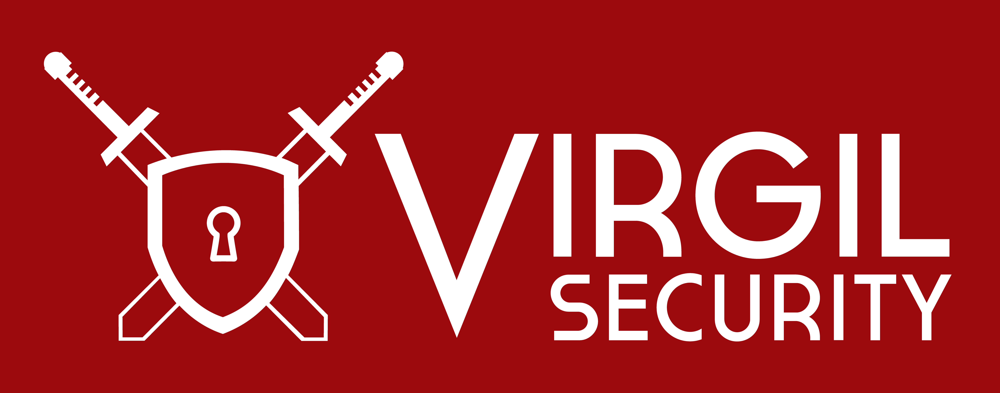

[Virgil Security](https://virgilsecurity.com) is a stack of security libraries and all the necessary infrastructure to enable seamless, end-to-end encryption for any application, platform or device. In a few simple steps you can encrypt communication, securely store data, provide passwordless login, and ensure data integrity.

Our libraries allow developers to get up and running with Virgil API quickly and add full end-to-end security to their existing digital solutions to become HIPAA and GDPR compliant and more.

Virgil Security, Inc. guides software developers into the forthcoming security world in which everything will be encrypted (and passwords will be eliminated). In this world, the days of developers having to raise millions of dollars to build secure chat, secure email, secure file-sharing, or a secure anything have come to an end. Now developers can instead focus on building features that give them a competitive market advantage while end-users can enjoy the privacy and security they increasingly demand.

# Content
- [Community](#community)
- [Products](#products)
  - [Tools](#tools)
  - [SDK](#sdk)
- [License](#license)

# Community
### Web resources
* [Main Website](https://VirgilSecurity.com)
* [Developers Documentation](https://developer.virgilsecurity.com/docs)
* [Virgil Developer Dashboard](https://dashboard.VirgilSecurity.com)
* [Help Center](https://help.VirgilSecurity.com)
* [Passw0rd Community](https://passw0rd.io/)

### Social media
* [Facebook](https://www.facebook.com/VirgilSec)
* [Twitter](https://twitter.com/VirgilSecurity)
* [LinkedIn](https://www.linkedin.com/company/virgil-security-inc-/)
* [DOU](https://jobs.dou.ua/companies/virgil-security-inc/)

### Blogs
* [Medium Blog](https://medium.com/@VirgilSecurity)
* [Habr](https://habr.com/company/VirgilSecurity)

### Support
* Slack https://VirgilSecurity.slack.com/
* [Email](mailto:support@VirgilSecurity.com)

# Products

### Tools
* [Virgil CLI](https://github.com/VirgilSecurity/virgil-cli) - a tool to manage your Virgil account and applications.
* [Passw0rd CLI](https://github.com/passw0rd/cli) - a tool for interacting with the [Passw0rd Service](https://passw0rd.io/)

### SDK
* **E3Kit SDK** - Client-side SDK that simplifies work with Virgil services and presents the easiest way to add full end-to-end encryption (E2EE) security to your digital solutions. E3Kit interacts with Cards Service, Keyknox Service and Pythia Service and supports multi-device access and group chat features.
  * [Javascript](https://github.com/VirgilSecurity/virgil-e3kit-js) 
  * [Swift](https://github.com/VirgilSecurity/virgil-e3kit-x) 
  * [Kotlin](https://github.com/VirgilSecurity/virgil-e3kit-kotlin) 

* **PureKit SDK** - Server-side SDK allows developers to communicate with the Virgil PHE service and perform necessary operation to protect users' passwords and personal identifiable information in a database from data breaches and both online and offline attacks.
  * [PHP](https://github.com/VirgilSecurity/virgil-purekit-php) 
  * [C#.NET](https://github.com/VirgilSecurity/virgil-purekit-net) 
  * [Golang](https://github.com/VirgilSecurity/virgil-purekit-go)
  * [Kotlin/Java](https://github.com/VirgilSecurity/virgil-purekit-kotlin)  

* **Cards Service SDK** - interacts with Virgil Cards Service and allows developers to add end-to-end encryption (E2EE) security to their new and existing digital products. SDK can be used on both client-side and server-side.
  * [Javascript](https://github.com/VirgilSecurity/virgil-sdk-javascript)  
  * [C#/.NET](https://github.com/VirgilSecurity/virgil-sdk-net) 
  * [C++](https://github.com/VirgilSecurity/virgil-sdk-cpp)
  * [Swift/Objective-C](https://github.com/VirgilSecurity/virgil-sdk-x) 
  * [PHP](https://github.com/VirgilSecurity/virgil-sdk-php) 
  * [Java/Android](https://github.com/VirgilSecurity/virgil-sdk-java-android) 
  * [Python](https://github.com/VirgilSecurity/virgil-sdk-python) 
  * [Golang](https://github.com/VirgilSecurity/virgil-sdk-go)
  * [Ruby](https://github.com/VirgilSecurity/virgil-sdk-ruby) 

* **Pythia Service SDK** - allows developers to communicate with Virgil Pythia Service to generate a Brainkey (private Key which is based on a password) and protect user passwords in a database.
  * [Golang](https://github.com/VirgilSecurity/virgil-pythia-go)
  * [Node.js](https://github.com/VirgilSecurity/virgil-pythia-node) 
  * [Swift](https://github.com/VirgilSecurity/virgil-pythia-x) 
  * [C#/.NET](https://github.com/VirgilSecurity/pythia-net) 
  * [Java](https://github.com/VirgilSecurity/virgil-pythia-java) 

* **Keyknox Service SDK** - allows developers to communicate with the Virgil Keyknox Service to upload, download, and synchronize encrypted sensitive data (private keys) between user's devices.
  * [Kotlin/Java](https://github.com/VirgilSecurity/virgil-keyknox-kotlin) 
  * [Swift](https://github.com/VirgilSecurity/virgil-keyknox-x) 
  * [Javascript](https://github.com/VirgilSecurity/virgil-keyknox-javascript) 

* **Double Ratchet Service SDK** - allows developers to communicate with PFS service and implements the Double Ratchet algorithm, which is used by parties to exchange encrypted messages based on a shared secret key.
  * [Swift](https://github.com/VirgilSecurity/virgil-ratchet-x) 

* **PFS Service SDK** - interacts with Virgil PFS Service and allows developers to add Virgil Perfect Forward Secrecy (PFS) to their end-to-end chat to prevent a possibly compromised long-term secret key from affecting the confidentiality of past communications.
  * [Swift](https://github.com/VirgilSecurity/virgil-sdk-pfs-x) 
  * [C#/.NET](https://github.com/VirgilSecurity/virgil-pfs-net) 
  * [Java](https://github.com/VirgilSecurity/virgil-pfs-java)  
  
### Services

* [Cards Service](https://developer.virgilsecurity.com/docs/api-reference/card-service/v5) - Stores and manages users' Virgil Cards with Public Keys and associated information.
* [Pythia Service](https://developer.virgilsecurity.com/docs/api-reference/pythia-service/v1) - Service provides developers with an ability to generate a user's restorable keypair based on a password.
* [Keyknox Service](https://developer.virgilsecurity.com/docs/api-reference/keyknox-service/v1) - Allows developers to securely store private keys and secrets in the Virgil Cloud and share them between their devices.
* [PFS Service](https://developer.virgilsecurity.com/docs/api-reference/pfs-service/v4) - Service dedicated to managing one-time and long-time keys used to solve a Perfect Forward Secrecy scenario.

### Cryptographic Library

[Virgil Crypto](https://github.com/VirgilSecurity/virgil-crypto) is an open-source high-level cryptographic library that allows you to perform all necessary operations for secure storing and transferring data in your digital solutions. Crypto Library is written in C++, suitable for mobile and server platforms and supports bindings with the following programming languages: Swift, Obj-C, Java (Android), С#/.NET, JS, Python, Ruby, PHP, Go.

* **Wrappers**
  * [Javasript](https://github.com/VirgilSecurity/virgil-crypto-javascript) 
  * [PHP](https://github.com/VirgilSecurity/virgil-crypto-php)
  * [C#/.NET](https://github.com/VirgilSecurity/virgil-crypto-net)
  * [Ruby](https://github.com/VirgilSecurity/virgil-crypto-ruby) 
  * [C](https://github.com/VirgilSecurity/virgil-crypto-c) 
  * [Python](https://github.com/VirgilSecurity/virgil-crypto-python) 
  * [Golang](https://github.com/VirgilSecurity/virgil-crypto-go) 
  * [Kotlin](https://github.com/VirgilSecurity/virgil-crypto-kotlin)
  * [Swift](https://github.com/VirgilSecurity/virgil-crypto-x) 

#### Other:
* [C#/.NET Crypto Library](https://github.com/VirgilSecurity/virgil-sdk-crypto-net) 
* [Swift/Objective-C Crypto API](https://github.com/VirgilSecurity/virgil-cryptoapi-x) 
* [PHP Crypto API](https://github.com/VirgilSecurity/virgil-cryptoapi-php)
* [Kotlin Crypto API](https://github.com/VirgilSecurity/virgil-cryptoapi-kotlin)
* [Swift Crypto Library Wrapper](https://github.com/VirgilSecurity/virgil-cryptowrapper-x) 

# Production Applications
* Virgil Messenger iOS
* VIrgil Messanger Android
* [Virgil Pure Wordpress Plugin](https://github.com/VirgilSecurity/virgil-pure-wordpress) - Free Wordpress Plugin based on a powerful and revolutionary cryptographic technology that protects user passwords from data breaches and both online and offline attacks.
* Virgil PasspostJS

# Integration

### Firebase 
* Tutorials
  * [Add end-to-end encryption to your Twilio Programable Chat](https://developer.virgilsecurity.com/docs/use-cases/v5/encrypted-communication-for-twilio) - In this tutorial, we will help you add end-to-end encryption to your product to secure your messages and user data
* Demos
  * [Demo iOS](https://github.com/VirgilSecurity/demo-firebase-ios) - A simple iOS application that demonstrates how the end-to-end encryption works. The application uses firebase as a backend service for authentication and chat messaging.
  * [Demo Android](https://github.com/VirgilSecurity/demo-firebase-android) - A simple Android application that demonstrates how the end-to-end encryption works. The application uses firebase as a backend service for authentication and chat messaging.
  * [Demo Javascript](https://github.com/VirgilSecurity/demo-firebase-js) - A simple Web application that demonstrates how the end-to-end encryption works. The application uses firebase as a backend service for authentication and chat messaging, and Virgil E3Kit SDK for end-to-end encryption.
### Twilio
### Pubnub
### Back4app
### Nexmo

# Virgil Blog Posts (by tags)

# License
BSD 3-Clause. See [LICENSE](https://github.com/VirgilSecurity/virgil/blob/master/LICENSE) for details.

# Contacts
Our developer support team is here to help you. Find out more information on our [Help Center](https://help.virgilsecurity.com/).

You can find us on [Twitter](https://twitter.com/VirgilSecurity) or send us email support@VirgilSecurity.com.

Also, get extra help from our support team on [Slack](https://virgilsecurity.com/join-community).
