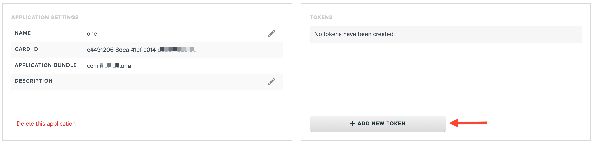
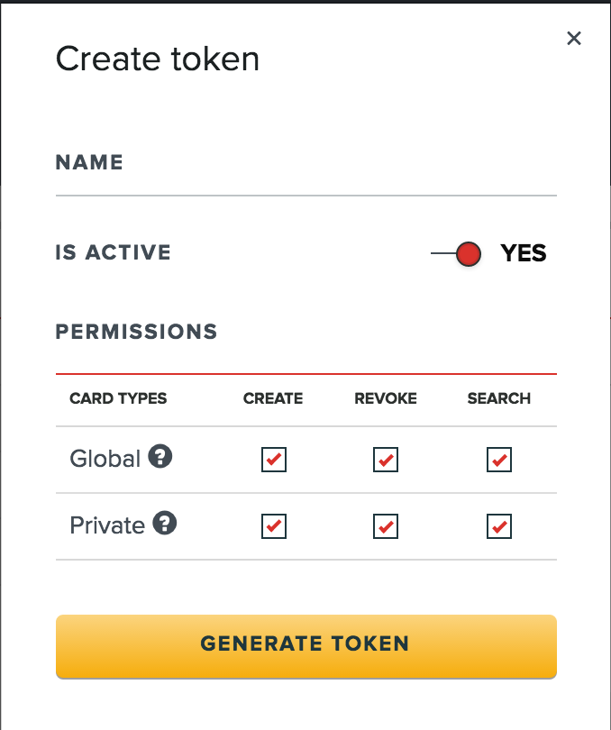

=========
Add an Access Token to your Application
=========

Every app requires a token to interact with :doc:`services`. The access token provides an authenticated secure access to the :doc:`cards-service` and is passed with each API call. The access token also allows the API to associate your app’s requests with your Virgil Security developer’s account.

1. :doc:`create-app`.

2. Add new token in Tokens section:

3. Add a name and set permissions for :term:`Virgil Cards <Virgil Card>` to use the token, these permissions can be updated at any time.

.. note::

  * :term:`Global Cards <Global Virgil Card>` are automatically verified in :doc:`identity-service`, they are globally available to all Virgil users.
  * :term:`Private Cards <Private Virgil Card>` are verified by a developer himself, they are available only within the current application.

**Permissions**

``CREATE`` – create a Virgil Card using this token

``REVOKE`` – delete a Virgil Card using this token

``SEARCH`` – search for Virgil Cards using this token

4. Now the token is created. It can be *edited*, *deleted* or *deactivated/activated*.
Example of a token: 
::

  AT.812a81accecc2dfab299a89cb400d7a443a1e1d06921780af42f194e53e9013c
