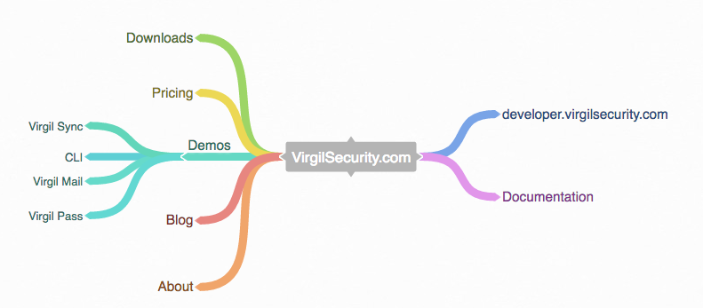

###############################################################
Virgil Security. Key Management and Cryptography for Developers
###############################################################

Developers Docs
---------------------

.. toctree::
   :maxdepth: 1
   
   sdk/sdks
   services/services
   crypto-library/crypto-library
   genindex
   use-cases/use-cases
   cli/cli
   faq/faq
..   glossary/glossary
..   quickstart/quickstart

Indices and tables
==================

* :ref:`genindex`
* :ref:`search`

License
--------------------

BSD 3-Clause. See `LICENSE <https://github.com/VirgilSecurity/virgil/blob/master/LICENSE>`_ for details.

Contacts
-------------------

Email: support@virgilsecurity.com

.. image:: images/docs-developer.png
	:width: 75%

