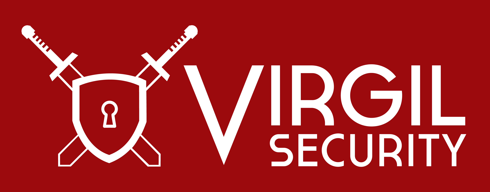

`Developers Docs`_ | `Virgil Services`_ | `Use cases`_  | `Virgil Demos`_

Virgil is a stack of security libraries (ECIES with Crypto Agility wrapped in Virgil Cryptogram) and all the necessary infrastructure to enable seamless, end-to-end encryption for any application, platform or device. See below for currently available languages and platforms. Get in touch with us to get preview access to our key infrastructure.

Virgil Security, Inc. guides software developers into the forthcoming security world in which everything will be encrypted (and passwords will be eliminated). In this world, the days of developers having to raise millions of dollars to build a secure chat, secure email, secure file-sharing, or a secure anything have come to an end. Now developers can instead focus on building features that give them a competitive market advantage while end-users can enjoy the privacy and security they increasingly demand.

Developers Docs
---------------------

.. toctree::
   :maxdepth: 2
   
   Virgil-Entities
   dot-net-csharp-quickstart
   javascript-quickstart
   c-cpp-quickstart
   objective-c-swift-quickstart
   java-android-quickstart
   python-quickstart

Virgil Services
---------------------

* `Private Keys Service <https://github.com/VirgilSecurity/virgil/wiki/Virgil-Private-Keys-API>`_
* `Public Keys Service <https://github.com/VirgilSecurity/virgil/wiki/Virgil-Keys-API>`_
* `Identity Service <https://github.com/VirgilSecurity/virgil/wiki/Identity-Service>`_

Use cases
---------------------

* `Passwordless authentication <https://github.com/VirgilSecurity/virgil/wiki/Passwordless-authentication>`_
* `Verification <https://github.com/VirgilSecurity/virgil/wiki/Verify-data>`_
* `Secure data at transport <https://github.com/VirgilSecurity/virgil/wiki/Secure-data-at-transport>`_
* `Secure data at storage <https://github.com/VirgilSecurity/virgil/wiki/Secure-data-at-storage>`_
* `IP messaging <https://github.com/VirgilSecurity/virgil/wiki/IP-messaging>`_

Virgil Demos
-------------------

* `Virgil Mail <https://github.com/VirgilSecurity/virgil-mail>`_
* `Virgil Pass <https://github.com/VirgilSecurity/express-virgil-passwordless>`_
* `Virgil Sync <https://github.com/VirgilSecurity/virgil-sync>`_

License
--------------------

BSD 3-Clause. See `LICENSE <https://github.com/VirgilSecurity/virgil/blob/master/LICENSE>`_ for details.

Contacts
-------------------

Email: support@virgilsecurity.com
