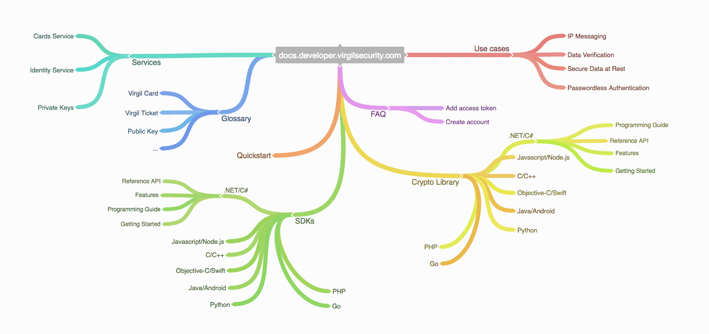

#########
Virgil Security. Key Management and Cryptography for Developers
#########

Developers Docs
---------------------

.. toctree::
   :maxdepth: 2
   
   services
   glossary
   quickstart
   sdks
   crypto-library
   use-cases
   faq

Indices and tables
==================

* :ref:`genindex`
* :ref:`search`

License
--------------------

BSD 3-Clause. See `LICENSE <https://github.com/VirgilSecurity/virgil/blob/master/LICENSE>`_ for details.

Contacts
-------------------

Email: support@virgilsecurity.com

.. image:: Images/Virgil-website.png
