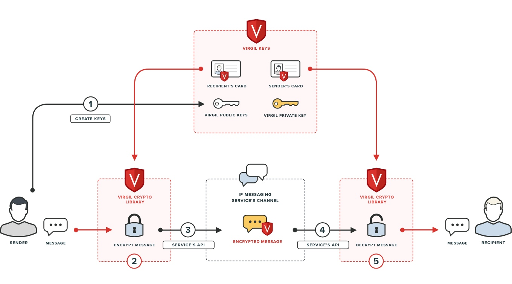

============
Quickstart Python
============

- `Introduction`_
- `Prerequisites`_
    - `Obtaining an Access Token`_
    - `Install`_
- `Use case`_ 
    - `Step 0. Initialization`_
    - `Step 1. Generate and Publish the Keys`_
    - `Step 2. Encrypt and Sign`_
    - `Step 3. Send a Message`_
    - `Step 4. Receive a Message`_
    - `Step 5. Verify and Decrypt`_
- `Source code`_

*********
Introduction
*********

In this guide we will get you up and running quickly with a simple IP messaging chat application you can build as you learn more about Virgil Crypto Library and Virgil Keys Services. Sounds like a plan? Then let's get cracking!

On the diagram below you can see a full picture of how these things interact with each other.

*********
Prerequisites
*********

Obtaining an Access Token
=========

First you must create a free Virgil Security developer's account by signing up `here <https://developer.virgilsecurity.com/account/signup>`_. Once you have your account you can `sign in <https://developer.virgilsecurity.com/account/signin>`_, create an application and generate an access token for your application.

The access token provides authenticated secure access to Virgil Keys Services and is passed with each API call. The access token also allows the API to associate your app's requests with your Virgil Security developer's account.

Use this token to initialize the SDK client here `Step 0. Initialization`_.

Install
=========

To install `package <https://cdn.virgilsecurity.com/virgil-crypto/python/>`_ use the command below:

.. code-block:: html

	python setup.py install

or you can use pip to download and install package automatically:

.. code-block:: html

	pip install virgil_sdk

You can easily add an SDK dependency to your project, just add the following code:

.. code-block:: python

	from VirgilSDK import virgilhub
	import VirgilSDK.virgil_crypto.cryptolib as cryptolib

*********
Use Case
*********
**Secure any data end to end**: users need to securely exchange information (text messages, files, audio, video etc) while enabling both in transit and at rest protection.

- Application generates public and private key pairs using Virgil Crypto library and uses Virgil Keys service to enable secure end to end communications:
	- public key on Virgil Public Keys Service;
	- private key on Virgil Private Keys Service or locally.
- Sender’s information is encrypted in Virgil Crypto Library with the recipient’s public key.
- Sender’s encrypted information is signed with his private key in Virgil Crypto Library.
- Application securely transfers the encrypted data, sender’s digital signature and UDID to the recipient without any risk to be revealed.
- Application on the recipient’s side verifies that the signature of transferred data is valid using the signature and sender’s public key in Virgil Crypto Library.
- The received information is decrypted with the recipient’s private key using Virgil Crypto Library.
- Decrypted data is provided to the recipient.

Step 0. Initialization
=========

.. code-block:: python

	identity_link = 'https://identity.virgilsecurity.com/v1'
	virgil_card_link = 'https://keys.virgilsecurity.com/v3'
	private_key_link = 'https://keys-private.virgilsecurity.com/v3'
	virgil_hub = virgilhub.VirgilHub('%ACCESS_TOKEN%', identity_link, virgil_card_link, private_key_link)

.. note::

	**ACCESS_TOKEN** - is received for your application in `Developers portal <https://developer.virgilsecurity.com/dashboard/>`_, described in this step `Obtaining an Access Token`_.

Step 1. Generate and Publish the Keys
=========
First a simple IP messaging chat is generating the keys and publishing them to the Public Keys Service where they are available in an open access for other users (e.g. recipient) to verify and encrypt the data for the key owner.

The following code example generates a new public/private key pair.

.. code-block:: python

	keys = cryptolib.CryptoWrapper.generate_keys(cryptolib.crypto_helper.VirgilKeyPair.Type_Default, '%PASSWORD%') 
	
The app is registering a Virgil Card which includes a public key and an email address identifier. The card will be used for the public key identification and searching for it in the Public Keys Service. You can create a Virgil Card with or without identity verification, see both examples `here <api-docs/python/keys-sdk#publish-a-virgil-card>`_.

.. code-block:: python

	data = {'Field1': 'Data1', 'Field2': 'Data2'}
	new_card = virgil_hub.virgilcard.create_card(virgilhub.IdentityType.email, 'sender-test@virgilsecurity.com', data, None, keys['private_key'], keys['public_key'])

Step 2. Encrypt and Sign
=========
The app is searching for all channel members' public keys on the Keys Service to encrypt a message for them. The app is signing the encrypted message with sender’s private key so that the recipient can make sure the message had been sent by the declared sender.

.. code-block:: python

	message = "Encrypt me, Please!!!"
	recipient_cards = virgil_hub.virgilcard.search_card('sender-test@virgilsecurity.com', type=None, include_unconfirmed=False, include_unauthorized=True)
	for card in recipient_cards:
    	    encrypted_message = cryptolib.CryptoWrapper.encrypt(message,card['id'], card['public_key']['public_key'])
    	    crypto_signature = cryptolib.CryptoWrapper.sign(message, keys['private_key'])

Step 3. Send a Message
=========
The app merges the message text and the signature into one structure and sends the message to the channel using a simple IP messaging client.

.. code-block:: python

	encryptedBody = {
    	    'Content': helper.base64.b64encode(bytearray(encrypted_message)).decode(),
    	    'Signature': helper.base64.b64encode(bytearray(crypto_signature)).decode()
	}
	encryptedBodyJson = json_dumps(encryptedBody)
	currentChannel.Send("recipient-test@virgilsecurity.com",encryptedBodyJson)

Step 4. Receive a Message
=========
An encrypted message is received on the recipient’s side using an IP messaging client.
In order to decrypt and verify the received data, the app on recipient’s side needs to get sender’s Virgil Card from the Keys Service.

.. code-block:: python

	message = currentChannel.GetMessage()
	encryptedBody = helper.Helper.json_loads(message.Body)
	senderCard = virgil_hub.virgilcard.search_card(sender, virgilhub.IdentityType.email)

Step 5. Verify and Decrypt
=========
The application is making sure the message came from the declared sender by getting his card on Virgil Public Keys Service. In case of success, the message is decrypted using the recipient's private key.

.. code-block:: python

	data = cryptolib.CryptoWrapper.decrypt(bytearray(helper.base64.b64decode(encryptedBody['Content'])), '%RECIPIENTS_CARD_ID%', recipientKeyPair['private_key'])
									 
	is_valid = cryptolib.CryptoWrapper.verify(''.join((map(chr, data))),encryptedBody['Signature'], senderCard[0]['public_key']['public_key'])
	if not is_valid:
    	    raise ValueError("Signature is not valid.")

*********
Source code
*********

* `Use Case Example <https://github.com/VirgilSecurity/virgil-sdk-python/tree/master/Examples/IPMessaging>`_

.. note:: Run scripts as root.
